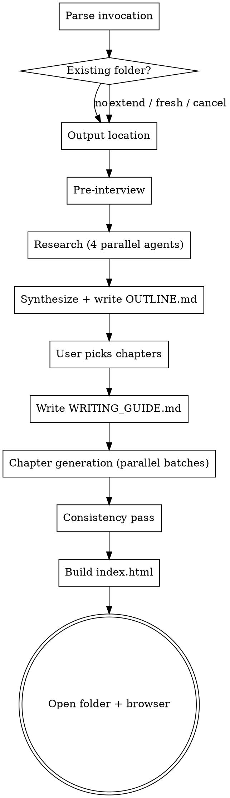

# /teach-me — Evidence-Based Course Generator

Produce a self-paced markdown course + self-contained HTML mini-course for any topic the user wants to learn. Designed for adult learners (CEFR B1 reading level, no prior knowledge), grounded in cognitive psychology and instructional-design research.

## When to Use

- User invokes `/teach-me <topic>` (or no arg — ask for the topic)
- User says "teach me about X", "I want to learn X", "deep dive on X", "create a course on X", "study X with me"
- Skip for: quick factual questions ("what is X" — just answer), code help, debugging, doc lookups, library API questions (use `context7` instead)

## Pedagogy Foundation (read before starting work)

This skill is grounded in well-replicated learning science. The rules below are not negotiable defaults — they are what the user is paying for:

1. **Concrete before abstract** (Goldstone, Fyfe et al.). Every chapter opens with a concrete observable instance before any abstract definition.
2. **Retrieval practice beats re-reading** (Roediger & Karpicke; Rowland 2014 meta-analysis). Every chapter ends with 3–5 free-recall prompts + 1 cross-chapter callback.
3. **Spaced exposure via deliberate callbacks** (Cepeda et al. 2006). Each major concept is *used* (not redefined) in ≥2 later chapters.
4. **Worked examples + backward fading** (Sweller, Renkl & Atkinson). Early chapters: full worked examples. Middle: progressively-blanked steps. Late: prompt-only.
5. **Cognitive Load Theory** (Sweller, Mayer). Max ~4 new named concepts per chapter. One new dimension of difficulty at a time.
6. **Segmenting / cards** (Mayer & Pilegard). Chapters are decks of 250–500-word cards, one concept per card, one diagram per card.
7. **Diagram-first visual coherence** (Mayer multimedia principles). Mandatory diagrams for relational concepts. No decorative imagery. Labels inline on the diagram, not in separate legends.
8. **Analogy hygiene** (Gentner structure-mapping). Every analogy followed within 2 sentences by an explicit "where this breaks down" disclaimer.
9. **Jargon gate** (Nathan/Koedinger expert-blind-spot research). Every technical term defined on first use OR linked to a glossary entry from an earlier chapter. No exceptions for "common" terms.
10. **Constrained self-explanation prompts** (Chi et al.; Bisra et al. 2018 g≈0.55). Between cards: "Finish this sentence: X works because ___" with model answer in a toggle.
11. **Plain language for B1 readers**. Mean sentence ≤18 words, max 25. ≤1 subordinate clause per sentence. Passive ≤10%. Active voice. Second person. No idioms.
12. **Build on what the learner already knows** (Ausubel). The pre-interview captures the user's known domains; the writing guide turns them into an analogy bank.
13. **Show state changes; don't narrate them** (Larkin & Simon 1987; Tversky & Morrison 2002 Apprehension Principle; Wong/Leahy/Marcus/Sweller 2012 transient-information effect; Tufte small multiples; Mayer's segmenting). When prose would walk through successive states ("first this, then that, after the crash…"), use a 2–5 panel `<div class="state-sequence">` instead. Same shape in every panel, delta annotated, caption = trigger + invariant. The reader sees the evolution; they don't read a story about it.

**Debunked — never use:** learning styles (VAK), 10,000-hours framing, gamification streaks/badges, decorative imagery for "engagement", "right-brain/left-brain", "digital natives".

## Process Flow



**Do not skip phases.** Track progress with TaskCreate so the user sees where you are.

---

## Phase 0 — Parse invocation

1. Get the topic from arguments. If no arg, reply: *"What topic do you want to learn? It can be technical (a library, language, concept) or non-technical (a philosophy, field, skill)."* and wait.
2. **Topic validation guards:**
   - If the topic is harmful (weapon synthesis, malicious hacking targets, illegal acts) — refuse briefly and stop. No lecture.
   - If the topic is impossibly broad (`programming`, `science`, `everything`) — ask the user to narrow with 2–3 concrete examples: *"That's very broad. Want to narrow to something like 'asynchronous programming patterns in TypeScript' or 'how compilers work'?"* Wait for a narrower answer.
   - If the topic is vague but tractable (`AI`, `databases`) — proceed; the freeform scope question in the interview will narrow it further.
3. Compute the slug: lowercase, replace non-alphanumerics with `-`, collapse repeated `-`, trim. Example: `Asynchronous Programming` → `asynchronous-programming`.

## Phase 1 — Existing folder check

1. Read output location from memory (see Phase 2 for how it's stored). If memory has no location yet, defer this check until after Phase 2 collects the location.
2. Check if `<output-location>/learn-<slug>/` already exists.
3. If it exists, present three options via `AskUserQuestion`:
   - **Extend** — add new chapters, regenerate specific chapters with new style notes, or refresh research and pick again.
   - **Start fresh** — rename existing folder to `learn-<slug>-archived-YYYY-MM-DD/` and proceed with a new course.
   - **Cancel** — stop.
4. If **Extend**: sub-options — (a) add chapters on new subtopics (skip to research with prior OUTLINE.md as context), (b) regenerate specific chapter numbers with new notes (skip to writing phase for those chapters), (c) refresh research and re-pick chapters (full re-run with prior OUTLINE.md merged in).
5. Never destructively overwrite a previous course.

## Phase 2 — Output location

1. Search memory for an entry tagged with `teach-me-output-location` or similar. Use `Glob` on `C:/Users/AlemTuzlak/.claude/projects/F--projects/memory/*.md` and `Grep` for `teach-me`.
2. If found and the path still exists, use it. State briefly: *"Writing to `<path>`."*
3. If not found, ask via `AskUserQuestion`:
   - **Use `F:/projects/learning/`** (creates the folder if missing) — Recommended.
   - **Use the current working directory** (`./`).
   - **Specify a different path** — user provides via "Other".
4. After the user answers, ask: *"Save this as your default location for future `/teach-me` runs?"* — yes/no via `AskUserQuestion`.
5. If yes, write a memory file `teach_me_output_location.md` with frontmatter `type: user` and the path in the body. Update `MEMORY.md` with one line.
6. Now retry the Phase 1 existing-folder check with the resolved location.

## Phase 3 — Pre-interview

Ask in two round-trips:

### Round 1 — single AskUserQuestion with 4 structured questions

```
Q1 [Current knowledge]: How much do you already know about <topic>?
  - Never heard of it
  - Know the terminology, no hands-on experience
  - Have built basic things
  - Intermediate practitioner

Q2 [End-goal proficiency]: Where do you want to end up?
  - Conceptual overview only
  - Can build basic things
  - Can build production-grade things
  - Can teach others

Q3 [Depth budget]: How much do you want?
  - Quick primer (~3–5 chapters)
  - Standard (~6–10 chapters)
  - Deep dive (everything researched, 10–15+ chapters)

Q4 [Practice load]: How much hands-on practice?
  - Light (read-focused)
  - Standard (read + retrieval + occasional exercise)
  - Heavy (every chapter has worked examples and exercises)
```

### Round 2 — single plain-text message reply

Send this exact message (substitute `<topic>`):

> Two more things before I start researching:
>
> **1. What do you already know well?** List languages, frameworks, fields, hobbies — anything you've spent serious time on (e.g. "TypeScript, React, music theory, cooking, chess"). I'll use these as **analogy sources** to anchor new concepts to what you already know.
>
> **2. Any specific angle within <topic>**, or should I cover it broadly? Say "surprise me" for full coverage.

Wait for a single reply containing both. Parse loosely — accept comma-separated lists, bulleted lists, or freeform.

Persist the answers in a working struct (you'll write them into OUTLINE.md and WRITING_GUIDE.md later).

## Phase 4 — Research (4 parallel agents)

Dispatch **one batched `Agent` call** containing 4 `general-purpose` subagents. They run in parallel. Each gets a self-contained brief and reports back a structured report.

**Lane A — Authoritative content.** Find top articles, tutorials, conference talks, and papers on `<topic>`. WebSearch + WebFetch the highest-signal results. Return 8–15 with one-line "why-to-read" for each, tagged `[article|tutorial|talk|paper]`.

**Lane B — Niche influencers and practitioners.** Find specific people known for `<topic>` — not tech celebrities, but practitioners with their own blogs/newsletters/Twitter who go deep on this niche. Return 4–8 with: name, personal outlet (blog URL), signature post URL, one-line on why they're worth following. Skip anyone whose only output is corporate marketing.

**Lane C — Canonical references.** Official docs, specs, reference implementations, definitive textbooks. If `<topic>` is a library/framework/CLI tool, use the `context7` MCP (`resolve-library-id` then `query-docs`) to get current canonical docs. Return 3–8 sources with version info.

**Lane D — Subtopic landscape and canonical language.** Survey the topic to produce a **tree of subtopics** with one-line descriptions (typically 8–15 subtopics). Suggest an instructional ordering (prerequisites first, advanced last). **If the topic is technical**, determine the **canonical language** used by official docs / most common in production (e.g. Temporal → TypeScript or Go; LangGraph → Python). State explicitly: *"Canonical language: X, because Y."*

Each agent reports under 800 words, structured. After all 4 return, synthesize.

## Phase 5 — Outline and chapter picks

1. Write `<output-location>/learn-<slug>/OUTLINE.md` with this structure:

```markdown
# Learning <Topic>

## Your goal (recorded)
- **Current level**: <answer from Q1>
- **Target proficiency**: <answer from Q2>
- **Depth**: <answer from Q3>
- **Practice load**: <answer from Q4>
- **Known domains (analogy bank)**: <comma-separated from Round 2>
- **Scope/angle**: <answer from Round 2>

## Subtopic landscape (from research)
1. <subtopic 1> — <one-line description>
2. <subtopic 2> — <one-line description>
...

## Suggested ordering
A prerequisite-respecting order with rationale for each step.

## Recommended chapters (~N, based on your depth budget)
Numbered list of proposed chapters. Each entry: short title + 1 line on what's covered + estimated cards (5–9 per chapter).

## Canonical language (technical topics only)
<language and one-line justification>

## Recommended sources
- [Source 1](url) — [type] — why-to-read
...

## Niche influencers worth following
- **Name** — [blog url] — signature post: [post url] — one-line on why
...
```

2. Auto-open the file: `Bash code --new-window "<absolute-path-to-OUTLINE.md>"`.
3. Reply to user with this exact message (substitute appropriately):

> I've written the outline to `<absolute-path>` and opened it for you.
>
> **Reply with which chapters to write:**
> - `all` — write every recommended chapter
> - `1,3,5-7` — specific chapters or ranges
> - Freeform — describe in your own words what to focus on
> - `reshape` — tell me what to add, remove, merge, or reorder before we commit
>
> If you choose `reshape`, I'll revise OUTLINE.md and ask again.

4. If user says `reshape`, take their notes, revise OUTLINE.md, save, re-open, ask again. Loop until committed.
5. Parse picks into a final ordered chapter list `picks = [...]`.

## Phase 6 — Write WRITING_GUIDE.md

Write `<output-location>/learn-<slug>/WRITING_GUIDE.md`. This file is the **shared brief for all chapter-writer agents and the consistency-pass agent**. It must be comprehensive and concrete.

Use the template at `<skill-dir>/assets/templates/WRITING_GUIDE.template.md` as the starting point — substitute the user's recorded interview answers into the placeholders (`{{TOPIC}}`, `{{CURRENT_LEVEL}}`, `{{TARGET_PROFICIENCY}}`, `{{PRACTICE_LOAD}}`, `{{KNOWN_DOMAINS}}`, `{{SCOPE}}`, `{{CANONICAL_LANGUAGE}}`).

Also point chapter writers at the component library reference at `<skill-dir>/assets/COMPONENTS.md` — they should skim it before writing. Callouts, diagram cards, compare blocks, tabs, stat cards, platform pills, and step lists are all available; some are auto-generated from markdown conventions, the rest are explicit HTML inside markdown.

Verify the generated file enforces all 12 pedagogy rules listed in the "Pedagogy Foundation" section at the top of this SKILL.md. If any rule isn't represented in the guide, add it before continuing.

## Phase 7 — Chapter generation (parallel batches)

Generate the picked chapters in **parallel batches of 3–5 writer subagents per round**, sequentially across rounds.

### For each round:

1. Pick the next 3–5 unwritten chapters from `picks`.
2. Dispatch them as **one batched `Agent` call** containing 3–5 `general-purpose` subagents in parallel. Each writes exactly one chapter.
3. Each writer's brief contains:
   - Path to `WRITING_GUIDE.md` (must read first)
   - Path to `OUTLINE.md` (for context on what the other chapters cover)
   - The full research reports from Phase 4 (paste inline, since subagents don't see prior context)
   - **Already-written chapter contents** (paste the markdown of any chapters from prior rounds — keeps consistency)
   - **The chapter spec**: number, title, subtopic, list of concepts to introduce, list of prerequisites, the ordering position
   - **The fading stage**: chapters 1–3 of the course → "full worked examples"; chapters 4 to (N-2) → "backward-faded examples"; final 2 chapters → "prompt-only practice"
   - **Concept ledger so far**: which concepts have been introduced, in which chapter (so this writer doesn't redefine and can do callbacks)
   - **Term ledger so far**: which terms have been glossed, in which chapter (so this writer can link without redefining)
4. Each writer writes:
   - `<output-location>/learn-<slug>/NN-<chapter-slug>.md` (where NN is zero-padded chapter number)
   - Any SVG diagrams needed into `<output-location>/learn-<slug>/diagrams/chNN-<name>.svg`
   - Returns a one-line completion summary
5. After the batch returns, update the concept ledger and term ledger from the new chapters' frontmatter.
6. Continue until all `picks` are written.

### Chapter markdown format (writers must follow this exactly)

```markdown
---
chapter: NN
title: <Chapter Title>
slug: <chapter-slug>
requires:
  chapters: [NN, ...]
  concepts: [concept-slug, ...]
introduces:
  concepts:
    - slug: concept-foo
      label: Foo
      first-definition: "A short canonical definition."
  terms:
    - term: workflow
      definition: A sequence of steps that survives process restarts.
callbacks: [concept-bar, concept-baz]  # concepts from earlier chapters used here
fading-stage: full-worked | backward-faded | prompt-only
---

## What you'll learn
- 3–5 bullet items

## Prereq check
> Before you start, try answering these. Click each to reveal the answer.

<details><summary>1. <prereq question 1></summary>
<answer>
</details>

<details><summary>2. <prereq question 2></summary>
<answer>
</details>

<details><summary>3. <prereq question 3></summary>
<answer>
</details>

---

## Card 1: <Card title>

<Concrete-first opener. First sentence MUST name a concrete observable instance. No abstract noun in the first sentence until a concrete instance has been introduced.>

<Body. One concept. ≤500 words for the whole card.>


*<one-sentence caption>*

<Maybe more body — kept short, supports the diagram.>

> **Self-explain**: Finish this sentence — "<concept> works because ___"
>
> <details><summary>Sample answer</summary>
> <model explanation in 1–2 sentences>
> </details>

---

## Card 2: <Card title>

(same structure)

---

<More cards. 5–9 cards total per chapter.>

---

## Recall (before scrolling away)

<details><summary>1. <free-recall question on this chapter>?</summary>
<answer>
</details>

<details><summary>2. <free-recall question on this chapter>?</summary>
<answer>
</details>

<details><summary>3. <free-recall question on this chapter>?</summary>
<answer>
</details>

<details><summary>4. Callback: <question referencing a concept from 2 chapters back, by name>?</summary>
<answer>
</details>

## Recap
- <mirror of the "What you'll learn" bullets, now stated as facts>

## Next
<one sentence pointing to the next chapter>
```

### Hard rules the writer must follow (these are also in WRITING_GUIDE.md)

- **Concrete-first opener** (rejected by consistency-pass otherwise)
- **Card separator**: `---` on its own line. Each card is 250–500 words.
- **One diagram per card** when the card's concept is relational. Diagrams are separate `.svg` files in `diagrams/`. Caption mandatory. No decorative imagery.
- **Labels inline on the diagram**, not in a separate legend block. No `## Legend` headers.
- **Analogy disclaimer**: if you write "**Analogy**:" or use phrases like "is like a", "think of … as", you must follow within 2 paragraphs with "**Where this breaks down**:" and at least one disanalogy.
- **Jargon gate**: every technical term gets a definition in the same paragraph on first use, OR is linked via `[term](#term-slug)` to a glossary entry created in an earlier chapter (check the term ledger you were given). No exceptions.
- **Analogy bank**: when introducing a new abstract concept, scan the known-domains list. If there's a clean analogy, use it (with mandatory disclaimer). If there isn't, skip — bad analogies are worse than none.
- **B1 prose**: mean sentence ≤18 words, max 25. ≤1 subordinate clause per sentence. Passive ≤10%. Active voice. Second person ("you"). No idioms ("low-hanging fruit", "moving the needle", "on the same page", etc. — banned).
- **No filler**: "It's important to note that", "In conclusion", "This is a great way to", etc. — banned.
- **Code blocks** (technical topics only):
  - Language is the canonical language from Phase 4 Lane D, unless the user's freeform scope explicitly requested another.
  - Every block has a one-line comment above (what it does in code terms) and a one-line plain explanation below (what it does for the reader).
  - Code must be runnable / copy-pasteable. No abstract pseudocode.
- **Density rule**: if a card has more than 600 words without a diagram, that's a defect — find what should have been visualized.
- **Fading stage**: respect the assigned fading stage for worked examples.
- **Write like a human** (see WRITING_GUIDE.md rule 13). Short paragraphs, plain ASCII punctuation, minimal markdown emphasis. **Banned everywhere in chapter prose, captions, recall answers, and summaries:**
  - em-dash `—` (U+2014) and en-dash `–` (U+2013). Restructure the sentence.
  - decorative glyph separators including `x` used as a multiplier in prose.
  - "It is not X, it is Y" / "It's not X: it's Y" / "Not just X, but Y" framing. State the point directly.
  - "Key insight", "Key takeaway", "Pro tip", "Bottom line", "TL;DR" and any phrase that announces an insight. Just state it.
  - Bolded `**Label**:` mini-headings sprayed across paragraphs. Bold is for the one term that matters, not for visual structure.

### Diagram SVG conventions

- ViewBox: `0 0 800 480` (the viewer container is 800×480 max; smaller is fine)
- Colors: stick to a 4-color palette — see WRITING_GUIDE.md. Default: `#1f2937` (text/strokes), `#3b82f6` (primary fill), `#f59e0b` (accent), `#10b981` (success/positive)
- Font: `system-ui, -apple-system, sans-serif`, size 14–18px
- Strokes: 1.5px or 2px
- Padding: ≥16px around any text label
- For interactive diagrams (opt-in): include `data-interactive="hover-explain"` on the root `<svg>` and add `data-explain="<text>"` attrs on labeled elements. The HTML viewer wires up tooltips automatically.

## Phase 8 — Consistency pass

Dispatch **one `general-purpose` subagent** with this brief:

> Read every chapter file in `<output-location>/learn-<slug>/`. Validate and fix:
>
> 1. **Concrete-first openers** — first sentence of every chapter must name a concrete instance. Patch openers that start with abstract definitions.
> 2. **Banned phrases and constructs**. Scan for the banned-phrase list in WRITING_GUIDE.md. Rewrite offending sentences. This includes:
>    - All idioms and filler from rule 7 and rule 8.
>    - Every em-dash `—` and en-dash `–` in chapter prose, captions, recall answers, and summaries. Restructure the sentence (split, comma, parentheses).
>    - "It is not X, it is Y" / "It's not X: it's Y" / "Not just X, but Y" framing. Rewrite as a direct statement.
>    - "Key insight", "The key insight", "Key takeaway", "Pro tip", "Bottom line", "TL;DR" and similar insight-announcer phrases. Drop the announcer; keep the claim.
>    - Glyph separators like `x` used as a multiplier in prose. Use the word `by`.
>    - Bolded `**Label**:` mini-headings sprayed across paragraphs of a single card (more than 2 in a card). Flatten into prose.
> 3. **Sentence length** — flag sentences >25 words. Rewrite them.
> 4. **Card length** — flag cards >600 words. Either split into two cards or compress.
> 5. **Diagram references** — every `` must resolve to an actual file. If a chapter references a missing SVG, write a minimal SVG into `diagrams/`.
> 6. **Analogy hygiene** — every "**Analogy**:" or "is like a/think of … as" must have a "**Where this breaks down**:" within 2 paragraphs.
> 7. **Jargon gate** — every technical term must be defined on first use or link to a glossary entry. Maintain a consolidated term ledger (see step 11).
> 8. **Spaced callbacks** — each major concept introduced in chapter N must be *used* (not redefined) in ≥2 later chapters. Check the introduces/callbacks frontmatter. Patch chapters that fail this.
> 9. **Required sections** — every chapter must have `## What you'll learn`, `## Prereq check`, ≥3 cards, `## Recall`, `## Recap`, `## Next`. Add any missing sections.
> 10. **Cross-references** — `Chapter N` style references must point to chapters that exist. Patch dangling refs.
> 11. **Write `README.md`** — TOC linking each chapter, recorded goal, suggested reading order, prerequisites summary, learning-time estimate.
> 12. **Write `resources.md`** — only cite sources actually used in chapters. Plus the influencer block from research. Each source: title, type tag `[official|blog|video|paper|community]`, one-line why-to-read.
> 13. **Write `concepts.json`** — machine-readable concept ledger: `[{slug, label, first-definition, introduced-in, called-back-in: []}]`.
> 14. **Write `terms.json`** — machine-readable term ledger: `[{term, definition, first-use-chapter}]`.
> 15. **Write `course-meta.json`** — `{title, slug, goal, current-level, target-proficiency, depth, practice-load, known-domains, scope, canonical-language, chapters: [{number, title, slug, file, requires, introduces}]}`.

The consistency-pass agent writes the corrected files in place. Returns a summary of what was patched.

## Phase 9 — Build index.html

The HTML is built by a Node script in the skill's assets folder. It pre-renders code blocks with **Shiki** (dual github-light / github-dark themes, CSS-variable mode) so the runtime needs no highlighting library.

1. **Acquire `marked.min.js`** if missing (`<skill-dir>/assets/marked.min.js`). Use `WebFetch` from `https://cdn.jsdelivr.net/npm/marked/marked.min.js` and `Write` to disk. One-time cache. No `highlight.min.js` — Shiki replaces it.

2. **Install Shiki** if `<skill-dir>/assets/node_modules/shiki/` is missing. Run:
   ```
   npm --prefix <skill-dir>/assets install
   ```
   This is a one-time setup; subsequent builds reuse the cached install. The `package.json` and `package-lock.json` are committed with the skill.

3. **Run the build script:**
   ```
   node <skill-dir>/assets/build-html.mjs <output-location>/learn-<slug>
   ```
   The script:
   - Reads `<skill-dir>/assets/templates/index.template.html`, `styles.css`, `viewer.js`, `marked.min.js`.
   - Reads the course's `course-meta.json`, `concepts.json`, `terms.json`, `resources.json`.
   - Reads each chapter markdown file in numeric order.
   - **Pre-renders every fenced code block** using Shiki's `codeToHtml` with both light and dark themes (CSS-variable mode). Marked.js sees the resulting HTML in the markdown body and passes it through unchanged at runtime.
   - Builds the sidebar chapter nav from `course-meta.chapters`.
   - Escapes `</script>` and `<!--` inside inlined markdown and JSON.
   - Substitutes all `{{PLACEHOLDER}}` tokens in the template.
   - Writes the final `index.html` to the course folder.

4. If the script fails, capture stderr and report. Common causes: missing chapter file referenced from `course-meta.json`, Shiki not installed (`npm install` step skipped), or an unfamiliar code-fence language (the script falls back to plain `<pre><code>` for unsupported languages — see `SUPPORTED_LANGS` in `build-html.mjs`).

The HTML viewer at runtime:
- Parses non-code markdown at page load (marked.js).
- Code blocks are already Shiki HTML — no client-side highlighting work.
- Splits each chapter on `---` separators into cards.
- Renders cards one at a time with prev/next nav and chapter nav.
- Native `<details>` elements render as click-to-reveal.
- Wraps occurrences of glossary terms with hover-tooltip popovers (uses `terms.json`).
- Tracks per-card / per-chapter read status in `localStorage` keyed by `teach-me:<slug>:progress`.
- Theme toggle (light/dark/auto). Shiki's dual-theme output respects `data-theme` automatically via CSS overrides.
- Search: substring filter across all chapter markdown; results list jumps to matching card.
- Interactive SVGs: any `<svg data-interactive="hover-explain">` gets tooltips wired to child `[data-explain]` elements.

## Phase 10 — Finish

1. Open the folder for the user:
   - `Bash explorer.exe "<absolute-path-to-learn-slug-folder>"`
2. Open the index.html in the default browser:
   - `Bash start "" "<absolute-path-to-index.html>"`
3. Reply with a concise summary:
   - One paragraph: what was generated, where it is, how many chapters, total cards estimate, how to use the HTML viewer.
   - Don't repeat the table of contents — the user can see it in README.md and the HTML sidebar.

---

## Failure modes and recovery

- **Research returns sparse results** — if any lane (especially influencers or canonical) returns fewer than the minimum, retry that lane once with broader search terms. If still sparse, proceed and note the gap in OUTLINE.md.
- **Writer agent produces a non-conforming chapter** — consistency-pass fixes most issues. If a chapter is structurally broken (missing required sections, wrong format), regenerate that single chapter with stricter instructions.
- **HTML build fails** — most likely cause: a `</script>` inside chapter markdown. Re-run the escape step and retry.
- **User interrupts** — partial work is on disk (chapters, OUTLINE, WRITING_GUIDE). On next `/teach-me <same-topic>` invocation, the existing-folder check offers "Extend → resume".

## Notes for the executor

- Use `TaskCreate` at the start to track phases. Mark each phase `in_progress` when you start it, `completed` when done. The user wants to see progress.
- Don't quote tool calls or paths in user-facing messages more than needed. Be concise.
- The skill is large — don't try to inline every detail of every chapter into your own context. Keep main thread focused on orchestration; subagents do the heavy lifting.
- After completion, suggest one logical follow-up: *"Want me to extend this with chapters on X, Y?"* if there are remaining unwritten subtopics from the OUTLINE.
- If anything in `WRITING_GUIDE.md` template is unclear for the topic at hand (e.g. analogy bank empty because user gave no known domains), call it out in the guide and proceed without forcing analogies.
